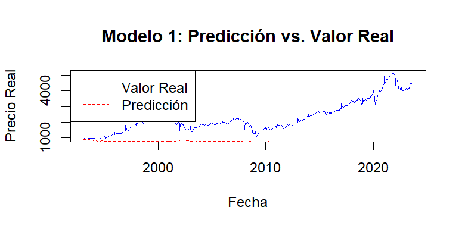
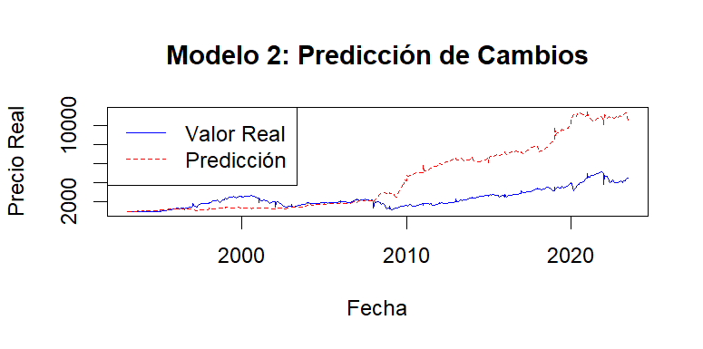
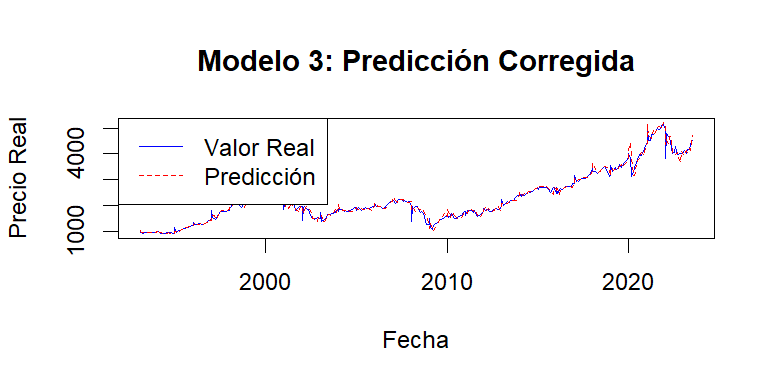

\newpage

# 1. Introducción

## 1.1 Introducción y Motivación

La motivación de este trabajo es aplicar los conceptos de computación estadística a un problema real y complejo: la modelización del índice bursátil S&P 500. El objetivo no es crear un sistema de predicción infalible, sino ejecutar el ciclo completo de modelado: desde la preparación de los datos y la construcción de un modelo, hasta su diagnóstico, evaluación e interpretación.

Este proyecto aplica los conceptos del curso sobre la construcción iterativa de modelos, la evaluación de su bondad de ajuste y la inferencia de la importancia de las variables.

Siguiendo las instrucciones de la actividad, este documento no incluye el código fuente completo. En su lugar, se adjuntan los archivos .R de cada modelo, los cuales están debidamente comentados para explicar su funcionamiento.

El análisis se basa en modelos de machine learning con Random Forest. Aunque no se cubrió en profundidad en clase, su inclusión en los apuntes del curso motivó su implementación para este trabajo.

La pregunta inicial que guía este trabajo es: "¿Cuál será el precio del activo S&P 500 en el futuro?". Sin embargo, como veremos en el desarrollo de los modelos, esta pregunta es metodológicamente difícil de responder directamente. Por ello, el análisis evolucionará para responder a una pregunta más precisa y estadísticamente robusta: "¿En qué medida podemos predecir la variación porcentual mensual del precio real del activo S&P 500?".

## 1.2 Idoneidad del Conjunto de Datos

El conjunto de datos elegido, que incluye la evolución histórica del S&P 500 junto a indicadores macroeconómicos clave (ganancias reales, dividendos reales, tipos de interés), es ideal para este análisis por varias razones:

* Complejidad Real: Modela un fenómeno que no sigue relaciones lineales simples, lo que justifica la exploración de modelos más avanzados.

* Naturaleza de Serie Temporal: Presenta desafíos como la tendencia y la autocorrelación, obligándonos a tratar los datos de una manera cronológicamente coherente, un concepto fundamental en la estadística aplicada.

* Potencial para Ingeniería de Variables: Para construir un modelo robusto, es necesario aplicar técnicas de *feature engineering*, como el cálculo de cambios porcentuales, retardos (`lags`) y medias móviles. Esta es una práctica central en el modelado moderno.

* Justificación de Modelos Avanzados: La complejidad de las relaciones justifica el uso de algoritmos más flexibles que la regresión lineal, como Random Forest. Esto nos permite ampliar los conceptos vistos en clase, enfrentando problemas prácticos como la incapacidad del modelo para extrapolar y la necesidad de ajustar sus hiperparámetros para mejorar la generalización, lo cual enriquece el aprendizaje.

# 2. Los Datos

Como fuente de datos para este análisis, hemos utilizado un fichero en formato `.csv` que recopila información histórica del mercado estadounidense. Cada fila del conjunto de datos representa una observación mensual, registrada el primer día de cada mes, abarcando un período histórico desde 1871-01-01 hasta 2023-09-01.

De las variables disponibles, hemos seleccionado las siguientes por su relevancia económica para la modelización:

* `Date`: La fecha de la observación.
* `Real Price`: El precio del índice S&P 500 ajustado por inflación. Esta será nuestra variable objetivo.
* `Real Earnings`: Las ganancias corporativas ajustadas por inflación.
* `Real Dividend`: Los dividendos pagados por las empresas, también ajustados por inflación.
* `Long Interest Rate`: La tasa de interés a largo plazo.

Se decidió excluir otras variables presentes en el fichero, como `PE10` (PER de Shiller). La razón principal para excluir `PE10` es que esta métrica se calcula utilizando el propio precio (`Real Price`), lo que introduciría un razonamiento circular en el modelo. Usar una variable que ya contiene la respuesta para predecir esa misma respuesta resultaría en un modelo engañosamente preciso pero metodológicamente incorrecto y sin valor predictivo real.

La selección de variables "reales" (ajustadas por inflación) es una decisión metodológica clave. Nos permite eliminar las distorsiones causadas por la pérdida de valor del dinero a lo largo del tiempo, permitiendo así un análisis más robusto del valor fundamental del mercado.

El dataset utilizado en este proyecto está disponible públicamente en: [https://datahub.io/core/s-and-p-500#data](https://datahub.io/core/s-and-p-500#data).

# 3. El Modelo

Para responder a nuestra pregunta de investigación, se siguió un enfoque de modelado iterativo. En lugar de presentar un único modelo final, esta sección documenta el proceso de desarrollo, mostrando la evolución desde un modelo inicial fallido hasta un modelo final robusto. Cada paso justifica el siguiente.


## 3.1 Modelo 1: El Enfoque Directo

El primer intento, y el más intuitivo, es predecir el nivel de precio (Real.Price) directamente, utilizando las variables fundamentales como predictores. El código completo para este modelo se adjunta en un fichero .R separado. A continuación, se muestra el gráfico resultante de dicho modelo.

```{r plot-model-1, echo=FALSE, fig.cap="Gráfico de predicción del Modelo 1."}

```

Como se observa claramente en el gráfico, este modelo fracasa. La línea de predicción (roja) se vuelve plana. Esto se debe a una limitación fundamental de los modelos basados en árboles (como Random Forest): no pueden extrapolar. El modelo no puede predecir un Real.Price más alto que el precio máximo que vio durante su entrenamiento.

Dado que este enfoque es inviable para una serie temporal con tendencia, debemos cambiar la pregunta.


## 3.2 Modelo 2: El Enfoque de Cambios (Predicción de Rentabilidad)

En lugar de predecir el precio, el Modelo 2 intentará predecir el cambio porcentual mensual (Price_Change). Luego, reconstruiremos el precio acumulando estos cambios predichos.

```{r plot-model-2, echo=FALSE, fig.cap="Gráfico de predicción del Modelo 2."}

```

Este modelo soluciona el problema de la extrapolación, pero crea uno nuevo: el error compuesto o "prediction drift". Al basar la predicción de cada mes en la predicción (errónea) del mes anterior, los pequeños errores del modelo se acumulan y magnifican, creando un "efecto bola de nieve" que hace que la predicción se desvíe completamente de la realidad.

## 3.3 Modelo 3: El Modelo Refinado (Predicción Corregida)

Para solucionar el "drift", implementamos dos mejoras:

1.  Añadimos variables de contexto (retardos y medias móviles) para que el modelo tenga "memoria" y una idea de la tendencia reciente.
2.  Cambiamos el método de predicción a una predicción "one-step-ahead". Cada mes, predecimos el cambio basándonos en el precio real del mes anterior, no en nuestra propia predicción acumulada. Esto elimina el error compuesto.

```{r plot-model-3, echo=FALSE, fig.cap="Gráfico de predicción del Modelo 3 (Final)."}

```

Como muestra el gráfico final, la predicción corregida del Modelo 3 sigue de cerca al valor real. Ha superado los problemas de extrapolación y de error compuesto. Aunque no es perfecta, captura la dirección y la magnitud de los movimientos del mercado con una fidelidad razonable.

Este Modelo 3 es el que usaremos como base para el análisis estadístico detallado en la siguiente sección.

# 4. Análisis estadístico

```{r setup-modelo-final, include=FALSE}
library(dplyr)
library(randomForest)
library(TTR)
datos_m3 <- read.csv("SP.csv")
datos_m3 <- datos_m3[order(as.Date(datos_m3$Date)), ]
datos_m3 <- datos_m3 %>%
  mutate(
    Price_Change = (Real.Price / lag(Real.Price)) - 1,
    Earnings_Change = (Real.Earnings / lag(Real.Earnings)) - 1,
    Dividend_Change = (Real.Dividend / lag(Real.Dividend)) - 1,
    Interest_Rate_Change = Long.Interest.Rate - lag(Long.Interest.Rate),
    Price_Change_Lag1 = lag(Price_Change, 1),
    SMA_10_Price_Change = SMA(Price_Change, n = 10)
  )
datos_m3 <- na.omit(datos_m3)
punto_corte_m3 <- floor(0.8 * nrow(datos_m3))
train_m3 <- datos_m3[1:punto_corte_m3, ]
test_m3 <- datos_m3[(punto_corte_m3 + 1):nrow(datos_m3), ]
set.seed(123)
rf_modelo_final <- randomForest(
  Price_Change ~ Earnings_Change + Dividend_Change + Interest_Rate_Change + Price_Change_Lag1 + SMA_10_Price_Change,
  data = train_m3,
  ntree = 500,
  nodesize = 10,  
  mtry = 3        
)
predicted_changes <- predict(rf_modelo_final, newdata = test_m3)
reconstructed_predictions <- numeric(length(predicted_changes))
for (i in 1:length(predicted_changes)) {
  if (i == 1) {
    base_price <- train_m3$Real.Price[nrow(train_m3)]
  } else {
    base_price <- test_m3$Real.Price[i - 1] 
  }
  predicted_price <- base_price * (1 + predicted_changes[i])
  reconstructed_predictions[i] <- predicted_price
}
resultados <- data.frame(
  Fecha = as.Date(test_m3$Date),
  Real = test_m3$Real.Price,
  Prediccion = reconstructed_predictions
)
```

En esta sección, se realiza un análisis detallado del Modelo 3. Es importante notar que las pautas de análisis proporcionadas en el guión de la actividad están orientadas a un modelo de regresión lineal (lm) clásico.

Dado que hemos utilizado un modelo de machine learning (Random Forest), no todos los puntos solicitados, como la estimación de parámetros o los contrastes de hipótesis, son directamente aplicables. Por lo tanto, adaptaremos el análisis: en lugar de interpretar coeficientes, estudiaremos la importancia de las variables; y en lugar de la selección stepwise, usaremos esa misma importancia para proponer simplificaciones.

Otros apartados, como la evaluación de la bondad de ajuste y el diagnóstico de residuos, se pueden aplicar de forma análoga para evaluar el rendimiento y la fiabilidad de nuestro modelo final.

## 4.1 Formulación y Supuestos del Modelo

A diferencia de un modelo lineal, Random Forest no se define por una única ecuación paramétrica (como $Y = \beta_0 + \beta_1X_1 + \epsilon$). Se trata de un modelo de *ensamblaje* no paramétrico.

Conceptualmente, nuestro `rf_modelo_final` construye una gran cantidad de árboles de decisión (`ntree = 500`) utilizando subconjuntos aleatorios de los datos y de las variables. La predicción final del modelo no es un coeficiente, sino el promedio de las predicciones de todos los árboles individuales.

Si $T_b(\mathbf{x})$ es la predicción del árbol $b$ (de un total de $B=500$ árboles) para un conjunto de predictores $\mathbf{x}$, la predicción final $\hat{y}$ es:

$$
\hat{y} = \frac{1}{B} \sum_{b=1}^{B} T_b(\mathbf{x})
$$

### Supuestos e Hipótesis

Una de las principales ventajas de Random Forest es su flexibilidad en cuanto a los supuestos:

1.  No Suposición de Linealidad: No asume que la relación entre los predictores (ej. `Earnings_Change`) y la respuesta (`Price_Change`) sea lineal. Puede capturar interacciones complejas.
2.  No Suposición de Normalidad: No requiere que los datos o los residuos sigan una distribución normal.
3.  No Suposición de Homocedasticidad: No asume que la varianza de los residuos sea constante.

Nuestra hipótesis de trabajo no es sobre el valor de un parámetro, sino sobre la *relevancia* de nuestras variables. La hipótesis es que las variables de ingeniería que hemos creado (los cambios en los fundamentales, el retardo `Price_Change_Lag1` y la media móvil `SMA_10_Price_Change`) contienen información útil y poseen poder predictivo sobre la variación mensual del precio real del S&P 500.

## 4.2 Ajuste e Interpretación del Modelo

### Ajuste de Hiperparámetros

En un modelo Random Forest, el "ajuste" no consiste en estimar coeficientes (parámetros), sino en definir los "hiperparámetros" que guían la construcción de los árboles. Para nuestro Modelo 3, se definieron los siguientes:

* `ntree = 500`: Establece el número de árboles de decisión ($B$) a construir. Se considera que 500 es un número suficientemente grande para que las predicciones se estabilicen y el error converja, asegurando un modelo robusto.

* `nodesize = 10`: Controla la profundidad de los árboles. Obliga a que cada "hoja" terminal de un árbol contenga un mínimo de 10 observaciones. Este es un mecanismo clave para prevenir el sobreajuste, ya que evita que el modelo cree reglas muy específicas basadas en pocas observaciones (ruido) del conjunto de entrenamiento.

* `mtry = 3`: Define el número de variables ($m$) que se seleccionan aleatoriamente como candidatas en cada división de un árbol. Teníamos 5 variables predictoras en total ($p=5$), y establecer $m=3$ asegura que los árboles no sean idénticos entre sí. Esta aleatorización de variables es la que "des-correlaciona" los árboles y da nombre al método, mejorando la capacidad de generalización del ensamblaje.

### Interpretación del Modelo: Importancia de Variables

Dado que no tenemos coeficientes $\beta$ para interpretar, la inferencia en Random Forest se realiza evaluando la **importancia de las variables**. El modelo nos dice qué predictores son más relevantes para reducir el error de predicción.

En las siguientes secciones, utilizaremos las funciones `importance(rf_modelo_final)` y `varImpPlot(rf_modelo_final)` de R para extraer y visualizar estas puntuaciones de importancia y así interpretar qué factores son los que más influyen en las predicciones de nuestro modelo.


## 4.3 Evaluación de la Bondad de Ajuste

La evaluación de la bondad de ajuste nos permite cuantificar qué tan bien las predicciones del Modelo 3 se ajustan a los datos reales del conjunto de prueba.

La primera evaluación es visual. Como se observó en el gráfico del Modelo 3 en la sección anterior, la predicción "one-step-ahead" (línea roja) sigue de cerca la tendencia y la dirección de los movimientos del precio real (línea azul). Esto sugiere que el modelo tiene un ajuste robusto y es capaz de capturar la dinámica del mes siguiente.

Para complementar este análisis visual, calculamos métricas de error numéricas. Siendo $y_i$ el valor real y $\hat{y}_i$ el valor predicho para las $n$ observaciones del conjunto de prueba, definimos:

* El RMSE (Root Mean Squared Error): Es la raíz cuadrada del promedio de los errores al cuadrado. Es particularmente sensible a errores grandes.

$$
\text{RMSE} = \sqrt{\frac{1}{n} \sum_{i=1}^{n} (y_i - \hat{y}_i)^2}
$$

* El MAE (Mean Absolute Error): Es el promedio de los errores absolutos. Mide la magnitud promedio del error, dándonos una idea de qué tan lejos, en promedio, está la predicción del valor real.

$$
\text{MAE} = \frac{1}{n} \sum_{i=1}^{n} |y_i - \hat{y}_i|
$$

```{r calculo-metricas-error, echo=TRUE, eval=TRUE, message=FALSE, warning=FALSE}
errores <- resultados$Real - resultados$Prediccion
rmse_modelo_3 <- sqrt(mean(errores^2))
mae_modelo_3 <- mean(abs(errores))
print(paste("Error Cuadrático Medio (RMSE):", round(rmse_modelo_3, 4)))
print(paste("Error Absoluto Medio (MAE):", round(mae_modelo_3, 4)))
```


Estos resultados numéricos nos dan una visión clara del rendimiento del Modelo 3.

El Error Absoluto Medio (MAE) es de 79.79. Esta es la métrica más interpretable: significa que, en promedio, nuestras predicciones a un mes vista se desvían 79.79 puntos del precio real.

El Error Cuadrático Medio (RMSE) es de 123.70. Como es de esperar, este valor es más alto que el MAE. La razón es que el RMSE eleva al cuadrado los errores antes de promediarlos, lo que penaliza de forma mucho más severa los errores grandes.

El hecho de que el RMSE sea significativamente mayor que el MAE (123.7 vs 79.8) es un hallazgo importante. Sugiere que el modelo, si bien es bastante preciso en promedio, comete algunos errores notablemente grandes en meses de alta volatilidad, y son estos errores atípicos los que inflan la métrica del RMSE.

## 4.4 Inferencia del Modelo: Importancia de Variables

Dado que Random Forest es un modelo no paramétrico, la inferencia no se realiza mediante el contraste de hipótesis o intervalos de confianza de los coeficientes, como se haría en una regresión lineal.

En su lugar, la inferencia se centra en determinar la relevancia o "importancia" de cada variable predictora. En este apartado, extraeremos las métricas de importancia de nuestro Modelo 3. Esto nos permitirá cuantificar qué predictores (como el cambio en las ganancias, o el retardo del precio) tienen el mayor impacto en la capacidad predictiva del modelo.

Presentaremos tanto la tabla numérica de importancia (basada en el %IncMSE) como su representación gráfica para facilitar la interpretación.


```{r inferencia-importancia, echo=TRUE, fig.cap="Importancia de las variables predictoras en el Modelo 3.", fig.align='center', out.width="60%"}
importancia_modelo <- importance(rf_modelo_final)
print(importancia_modelo)
varImpPlot(rf_modelo_final, main = "Importancia de Variables")
```


### Interpretación de la Importancia de Variables

El `varImpPlot` y la matriz de importancia nos proporcionan la conclusión más importante de nuestro análisis. La métrica mostrada en este caso es la `IncNodePurity` (Incremento en la Pureza de Nodos), también conocida como "Importancia Gini".

Esta métrica mide cuánto contribuye cada variable a "purificar" los nodos de los árboles; es decir, qué tan buena es la variable para agrupar observaciones con resultados similares. Un valor más alto indica que la variable es más importante para la estructura del modelo.

Los resultados son claros y consistentes con el análisis anterior:

1.  Price_Change_Lag1 (Importancia: 2.01): Esta es, con diferencia, la variable más importante. Nos indica que el cambio de precio del mes anterior es el predictor individual más potente. Esto confirma la existencia de "momentum" o inercia a corto plazo.

2.  SMA_10_Price_Change (Importancia: 1.59): La segunda variable más importante es la media móvil de los últimos 10 meses. Esto refuerza la idea de "momentum", pero a un plazo más largo (la tendencia reciente).

3.  Conclusión Clave: Las dos variables de contexto que creamos en el Modelo 3 (`Lag1` y `SMA`) son las dos más importantes. Esto valida por completo nuestra hipótesis de que los modelos anteriores fracasaban por falta de contexto histórico.

4.  Variables Fundamentales y Macro: Después de las variables de "momentum", encontramos los cambios en las variables fundamentales: `Earnings_Change` (1.24) y `Dividend_Change` (0.98). La variable macroeconómica `Interest_Rate_Change` (0.80) es la que menos poder predictivo aporta en este modelo.

## 4.5 Diagnóstico del Modelo: Análisis de Residuos

Para un diagnóstico completo del modelo, no basta con saber el error promedio; debemos analizar *cuándo* y *cómo* falla. En esta sección, calculamos los residuos (la diferencia entre el valor real y el predicho) para cada punto del conjunto de prueba.

El objetivo es doble: primero, identificar observaciones anómalas (fechas con errores de predicción inusualmente grandes) y, segundo, buscar patrones sistemáticos. Idealmente, los errores deberían ser aleatorios y centrados en cero. Un patrón indicaría que el modelo está omitiendo información.

```{r diagnostico-residuos, echo=TRUE, fig.cap="Análisis de Residuos del Modelo 3 a lo largo del tiempo",fig.align='center', out.width="60%"}
residuos <- resultados$Real - resultados$Prediccion
plot(resultados$Fecha, residuos, 
     type = 'h', col = "blue", main = "Diagnóstico: Residuos del Modelo 3 (vs. Tiempo)",
     xlab = "Fecha", ylab = "Error de Predicción (Residuos)")
abline(h = 0, col = "red", lty = 2)
```

### Interpretación del Gráfico de Residuos

El gráfico de residuos del Modelo 3 nos ofrece una visión clara de su rendimiento y sus limitaciones:

1.  Rendimiento Promedio: La gran mayoría de los errores (líneas azules) son pequeños y oscilan muy cerca de la línea cero. Esto es positivo e indica que, en condiciones normales de mercado, el modelo es bastante preciso y no tiene un sesgo sistemático.

2.  Observaciones Anómalas (Errores Grandes): El gráfico expone claramente las debilidades del modelo. Se observa un error negativo extremo (un pico hacia abajo) alrededor de 2008-2009, coincidiendo con la crisis financiera global. El modelo fue incapaz de prever la magnitud de esta caída. Se observa un segundo pico negativo, en 2020, coincidiendo con el pánico inicial de la pandemia.

3.  Conclusión del Diagnóstico: El modelo funciona razonablemente bien en el día a día, pero falla estrepitosamente al predecir eventos extremos mundialmente. Aparte de estos picos, los errores parecen ser aleatorios y no muestran patrones evidentes (como un embudo), lo cual es una característica deseable.

# 5. Conclusiones

Este trabajo ha demostrado que el desarrollo de un modelo estadístico es un proceso iterativo. Al comienzo del análisis, no es evidente qué enfoque será el más robusto. El primer intento de predecir el precio directamente (Modelo 1) fracasó, pero nos enseñó una lección fundamental sobre la incapacidad de los modelos de árbol para extrapolar en series temporales con tendencia.

El segundo intento (Modelo 2), aunque conceptualmente mejor al predecir los cambios, falló por el error compuesto, mostrándonos que el modelo era demasiado simple y carecía de contexto.

El éxito del Modelo 3 valida la importancia de la ingeniería de variables. Fue solo después de crear predictores que dieran "memoria" y "tendencia" al modelo (como `Price_Change_Lag1` y `SMA_10_Price_Change`) que se logró un ajuste coherente y robusto. La inferencia del modelo confirmó que estas variables de contexto eran, de hecho, las más importantes.

Finalmente, el análisis de residuos del modelo final es igualmente instructivo. Si bien el modelo se ajusta bien a condiciones normales de mercado, el diagnóstico muestra que es incapaz de predecir eventos extremos o "cisnes negros". Las crisis financieras o pandemias (como en 2008 o 2020) quedan fuera de su capacidad predictiva, lo que subraya las limitaciones inherentes de modelar sistemas tan complejos como los mercados financieros basándose únicamente en datos históricos.

\newpage

# 6. Referencias

* **Fuente de Datos:** https://datahub.io/core/s-and-p-500#data

* **Paquete R (randomForest):** https://CRAN.R-project.org/package=randomForest

* **Referencia Teórica:** https://doi.org/10.1023/A:1010933404324

* **Referencia Web:** https://www.youtube.com/watch?v=LkJpNLIaeVk
